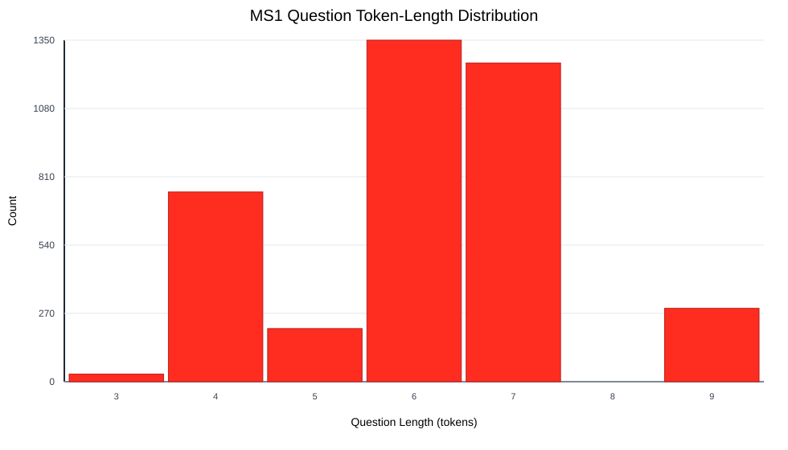
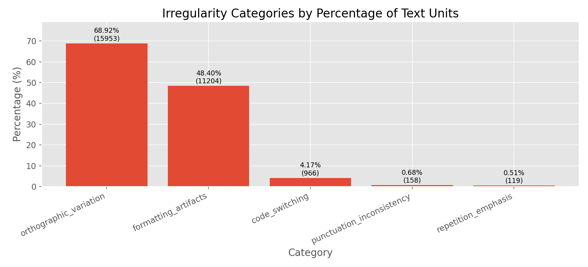
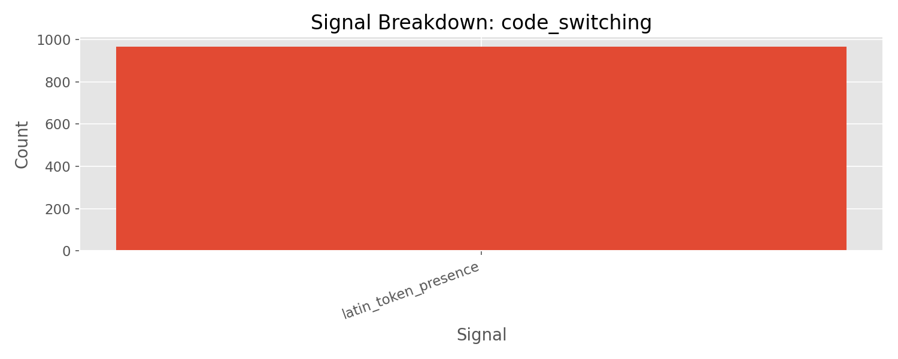
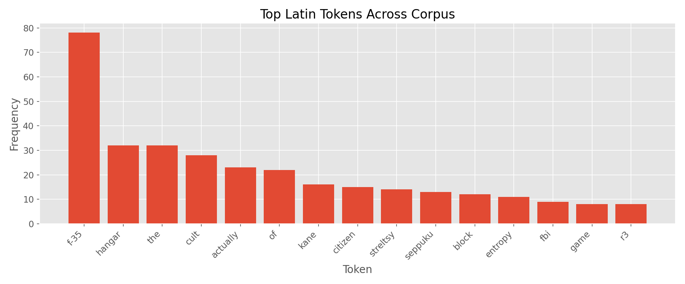
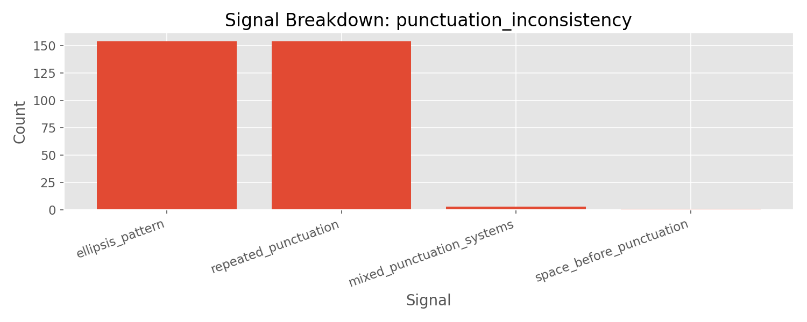

# Milestone 1 Technical Report

## 1) Ingest and Corpus Baseline

Milestone 1 focuses on turning a noisy Arabic transcript plus extractive QA corpus into a deterministic, model-ready dataset for downstream milestones. The pipeline executes in four ordered stages: profiling, irregularity detection, normalization, and dataset export.

The ingest summary confirms that all 13 transcript files and 13 QA files are loaded successfully, with pairing and record validation passing. The resulting dataset contains 3,890 QA records (rather than the nominal 3,900 expected from a strict 13 x 300 assumption), which is explicitly preserved and propagated through all downstream artifacts. This is a source-count mismatch, not a pipeline drop: 12 QA CSVs contain 300 rows, while `data/external/qa/8rcY34IA-6I_QA.csv` contains 290 rows (`question_id` runs from `..._Q1` to `..._Q290`), so `12*300 + 290 = 3890`.

### Profiling Tables

| Component   | Count | Token Min | Token Max | Token Mean | Token Median | Token Std |
| ----------- | ----: | --------: | --------: | ---------: | -----------: | --------: |
| Transcripts |    13 |    4329.0 |    9393.0 |     6875.2 |       6195.0 |    1595.7 |
| Questions   |  3890 |       3.0 |       9.0 |        6.1 |          6.0 |       1.4 |
| Answers     |  3890 |       1.0 |      10.0 |        4.9 |          5.0 |       1.6 |

| Component   | Count | Char Min | Char Max | Char Mean | Char Median | Char Std |
| ----------- | ----: | -------: | -------: | --------: | ----------: | -------: |
| Transcripts |    13 |  26431.0 |  59094.0 |   42638.0 |     38574.0 |   9810.5 |
| Questions   |  3890 |     14.0 |     38.0 |      29.5 |        31.0 |      6.0 |
| Answers     |  3890 |      3.0 |     52.0 |      27.9 |        28.0 |      8.2 |

These statistics show two important preparation constraints: (1) transcript contexts are very long relative to QA spans, and (2) QA lengths are tightly bounded while transcript lengths vary substantially, so normalization and cleaning must be aggressive on formatting noise but conservative on lexical content.

### Profiling Graph (question token-length distribution)

The profile is right-concentrated around 6-7 question tokens, which is consistent with short, extractive supervision prompts rather than free-form generative questions.

## 2) Irregularity Detection and Noise Characterization

Irregularity analysis covered 23,148 text units (`15,368` transcript lines + `3,890` questions + `3,890` answers). Detection included required categories (punctuation inconsistency, code switching, orthographic variation, formatting artifacts) plus an additional repetition-emphasis category.

### Category frequency interpretation

- Orthographic variation (`68.92%`) and formatting artifacts (`48.40%`) dominate corpus noise.
- Code switching (`4.17%`) is non-trivial and concentrated in technical named tokens.
- Punctuation inconsistency (`0.68%`) is low in frequency but high in tokenization impact (ellipsis and repeated punctuation).

### Category-level signal breakdown (selected figures)

Engineering interpretation:

- Most formatting noise comes from timestamp prefixes, which justifies deterministic line-level stripping.
- Orthographic variants include frequent alef/hamza and ya/alef-maqsura alternations, which directly increase vocabulary fragmentation.
- Code-switched terms are often topical entities (for example aircraft or technical words), so they should be retained rather than removed.

## 3) Cleaning and Normalization Decisions

### Cleaning policy and justification

Cleaning is deterministic and order-dependent:

1. Remove timestamp prefixes (`^\d+(?:\.\d+)?:\s*`).
2. Collapse internal whitespace.
3. Strip per-line edges.
4. Remove empty lines.
5. Join lines into continuous transcript context.

This policy targets structural artifacts while preserving semantic Arabic content. Empirically, transcript cleaning removed `103,315` characters out of `554,294` (`18.64%`), while QA cleaning removed only `3` characters out of `223,359` (`0.0013%`). This confirms that the heavy noise burden is in transcript formatting, not QA text.

### Normalization policy and justification

Character normalization applies four explicit rules (`tatweel`, `diacritics`, `alef variants`, `alef-maqsura to ya`). Risk analysis classifies the first two as low-risk and the latter two as moderate-risk; mitigation is uniform application to both context and QA fields to keep extractive alignment consistent.

Observed effect sizes:

- Transcript tokens changed: `15,282 / 78,269` (`19.52%`).
- QA tokens changed: `3,847 / 42,889` (`8.97%`).

These values indicate meaningful sparsity reduction without lexical deletion.

### Spelling inconsistency handling (high-confidence only)

Spelling analysis adds a conservative post-normalization layer:

- Canonical groups with variants: `838`
- Unified high-confidence groups: `108`
- Ambiguous groups left unchanged: `730`

Only groups with a dominant form >= 90% are unified; ambiguous groups are documented instead of force-corrected. This design intentionally trades aggressive cleanup for lower semantic risk.

## 4) Dataset Preparation for Downstream Modeling

The export stage builds a processed JSONL dataset under a stable schema contract and runs a deterministic usability check before handoff.

Each record preserves cross-artifact linkage:

- `sample_id`
- `transcript_id`
- `qa_id`
- `cleaned_record_id`
- `normalized_context`
- `question_text`
- `answer_text`
- `split`

Validation summary:

| Field          | Value |
| -------------- | ----- |
| `record_count` | 3890  |
| `split_count`  | 1     |

This confirms MS2 handoff readiness for baseline training while preserving deterministic lineage from raw source to processed sample.

## 5) Limitations and Conceptual Takeaways

### 5.1 Noise-to-signal lesson from corpus profiling

The irregularity profile shows that most corruption is structural rather than semantic: formatting artifacts and orthographic variation dominate, while punctuation inconsistency and explicit code switching are smaller but still meaningful. This matters because it reframes Milestone 1 as a signal-preservation problem, not a text beautification problem. In practical terms, deterministic structural cleanup yields large quality gains with low semantic risk, while lexical interventions must remain conservative.

### 5.2 Primary limitation: cleanup power vs semantic safety

The largest limitation in this milestone is not compute or tooling; it is ambiguity management. More aggressive normalization and spelling unification can make the corpus look cleaner and reduce sparsity further, but they also increase the chance of altering meaning, collapsing valid variants, or weakening extractive alignment between context and QA spans.

This tradeoff appears in several forms:

- Dialectal or context-dependent variants may look inconsistent globally but remain locally correct.
- Named entities and technical terms can be mistakenly "corrected" into less faithful forms.
- Frequency-dominant forms are not always semantically dominant forms.

For this reason, the milestone adopts an explicit risk posture: when confidence is high, normalize; when ambiguity is high, preserve. This is why high-confidence groups are unified while ambiguous groups are intentionally left unresolved and documented. The consequence is a less aggressively cleaned corpus than what is theoretically possible, but with substantially lower risk of semantic distortion in downstream modeling.

### 5.3 Reproducibility-first design and what we intentionally deferred

MS1 prioritizes reproducibility and traceability as core design constraints. Every transformation is deterministic, inspectable, and replayable so that counts, artifacts, and dataset lineage remain stable across runs.

More aggressive cleaning pipelines were possible, including broader heuristic rewriting or model-assisted normalization. However, these approaches often depend on context-sensitive or probabilistic decisions that are harder to audit and reproduce exactly. We therefore did not entertain them in the default MS1 pipeline, because they trade deterministic reproducibility for additional cleanup aggressiveness.
